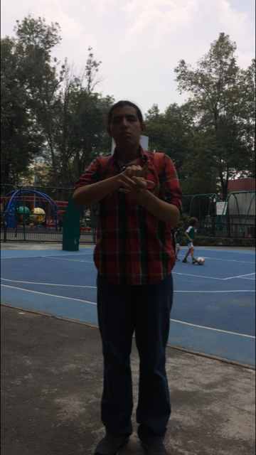

# Red Social - Proceso UX
Las redes sociales son sitios donde un grupo de personas con intereses comunes se comunican e interactuan en torno a un tema.
Una emprendedora nos ha encargado crear una red social.  Nos da ciertos temas en los que le gustaría invertir:

-   Alimentación
-   Feminismo
-   Educación
-   Salud
-   Energías Renovables

## Descubrimiento de la investigación
De acuerdo a lo anterior, nos decidimos centrarnos en el tema de educación específicamente en las personas con una discapacidad de tipo auditiva, para tener más información al respecto. Se realizaron dos tipos de investigaciones una documental y otra de campo.
En la primera de acuerdo a la documentación podemos definir los siguiente:

**Insights de la investigación**

*   Primer obstáculo es la comunicación.
    
*   Sordos tienen su propio idioma, su primer lengua es la de signos y la segunda el español.
    
*   Cuando no entienden algo pregunta a varias personas, ya que todos los días aprenden palabras nuevas.
    
*   Mejoran su lenguaje a través de sus propios recursos.
    
*   La sordera da lugar a una forma diferente de percibir y vivir el mundo que ha tenido como consecuencia el desarrollo de las lenguas de signos y la formación de comunidades de personas sordas con una historia y una cultura propias.
    
*   El español hablado como escrito y la lengua de señas tienen una gramática completamente distinta, lo que obliga a los sordos a razonar en dos formas diferentes.
    
*   Las redes sociales han modificado su vida debido a que sienten que escribir es útil.

En un segundo acercamiento al tema se decidió realizar un focus group con 5 estudiantes Sordos de Educación Media Superior, arrojando, en donde se hicieron diversas preguntas como: Qué red social utilizas con mayor frecuencia y porqué?; Qué problemas tienes al usarla?; Qué problemas tienes al interactuar con otras personas ya sean oyentes o sordos?; Cómo te comunicas con tus amigos?; Conoces algún sordo que haya estudiado la universidad?; Si existiera una red social solo para sordos que te gustaría que tuviera o para qué la usarías?

**Insights del focus group**

*   La red social que más utilizan los sordos es el whatsapp.
    
*  La comunicación con las personas oyentes es por medio de la escritura.
    
*   Ninguno conoce a otra persona sorda que haya cursado la universidad.
    
*   Sin embargo la mayoría del grupo quiere continuar con sus estudios superiores, aunque desconocen en qué institución puedan ingresar.
    
*   Han tenido problemas con sus amigos oyentes porque no entienden los mensajes que se escriben generan desacuerdos entre ellos.
    
*   Les gustaría tener una red social para la comunidad sorda ya que permitiría el intercambio de experiencias y conocer a otras personas con la misma condición. Aprenden de otros.

## Bechmark

## Design Sprint

## Análisis Argumentativo

Las redes sociales son sitios de Internet formados por comunidades de individuos con intereses o actividades en común y que permiten el contacto entre estos, de manera que se puedan comunicar e intercambiar información.

En México existen 2.4 millones de sordos, de los cuales, 124 mil 554 son jóvenes entre los 15 a 29 años, de estos el 28% no tienen ningún tipo de educación(INEGI 2014). A pesar de que muchos tienen un certificado de educación básica, hay un alto porcentaje que tienen rezago educativo en el área de matemáticas y lectoescritura.

El rezago educativo al que se enfrentan es el resultado por su paso en escuelas para oyentes en donde suelen ser excluidos o se les aprueban de grado sin necesidad demostrar sus conocimientos. La falta de educación para personas que no escuchan es causa de pocas oportunidades laborales. Es así que el 67% de esta población joven, es decir 83 mil no tienen ingreso económico propio.

La principal obstáculo al que “se enfrentan al momento de comunicarse con personas oyentes es la comprensión de la información ocasionada por un lenguaje pobre, que conduce a la marginación de la persona sorda.” (Amondarain y Correa, 2001). El español hablado como escrito y la lengua de señas tienen una gramática completamente distinta, lo que obliga a los sordos a razonar en dos formas diferentes.

Los sordos, se caracterizan fundamentalmente porque no pueden comunicarse por medio del habla con quienes los rodean, no de modo fluido y natural. Ellos necesitan comunicarse y socializar tanto como cualquier ser humano.En la actualidad la tecnología es una herramienta útil para la comunidad sorda. Los celulares han modificado su vida gracias a los mensajes de texto o video llamadas, en algunos casos ha mejorado el nivel de lectoescritura.

Se identificó que los jóvenes que terminan su educación media superior con esta condición si bien tienen la motivación de seguir adelante no cuentan con la orientación hacia que instituciones educativas dirigirse. De acuerdo a esta problemática es que surge la necesidad de crear una red social que permita la comunicación entre las distintas personas sordas que se encuentran en el país. Esta red permitirá el intercambio de experiencias educativas entre jóvenes sordos que ya han terminado su formación académica a nivel superior y aquellos que están próximos a terminar preparatoria.

Lo que permitirá que personas bajo la misma condición se den consejos para seguir estudiando, se identificaran entre ellos y favorecerá su autoestima y la imagen que tienen de sí mismos para su futuro. Será una oportunidad para que se den cuenta de que la sordera en sí no les impedirá alcanzar sus sueños si se lo proponen como hicieron otras personas con esta condición.

## Target

*   Jóvenes Sordos entre 19 a 35 años que cursan o cursaron la educación media superior y superior.
    
*   Con un nivel socioeconómico medio.
    
*   Son muy observadores y atentos al detalle.
    
*   Utilizan la tecnología para comunicarse con sus amigos y familiares.
    
*   Les gustan las redes sociales que son intuitivas y fáciles de comprender.
    
*   Les gusta poder comunicarse por medio de imágenes (gifs, memes) con otras personas.
   

## Argumentación del proyecto.

1.  **Negocio**. La *UNESCO* señala en su declaración mundial de 1990 que *“Educación para todos”*. Bajo este principio y aunado al nuevo modelo educativo incluyente. Las universidades han desarrollado proyectos de inclusión. Tal es el caso de la Universidad Santa Catarina, en Nuevo León, donde si un alumno sordo necesita un traductor a Lengua de Señas Mexicana, éste llega al salón cuando va a tomar clase; Universidad Teletón, con su cultura incluyente; UNAM fomentando una cultura de integración para personas con discapacidad; Universidad de Coahuila; UDG.

Sin embargo estas universidades no cuenta con suficiente publicidad para llegar al público adecuado y así responder a sus necesidades. Por lo cual tener una plataforma donde se concentren estudiantes cuyo perfil encaja para estudiar la universidad y tener ex alumnos de estas instituciones siendo los principales promotores. Permitirá ofrecer a estas instituciones un espacio para su publicidad dirigida específicamente a estudiantes que están por cursar su educación superior.

Además de ofrecer un espacio para que otras instituciones ofrezcan cursos o talleres a un público que ha estado descuidado o bien publicitar servicios como intérprete.
  

2.  **Usuario**. Si bien existen redes sociales dirigidas a personas sordas, se ha dejado de lado el tema de educación. Siendo así un target potencial para su atención.

## Historias de Usuario

Israel es un estudiante Sordo de preparatoria que esta próximo a culminar sus estudios, tiene la intención de seguir a nivel superior sin embargo no conoce a ninguna persona Sorda que haya cursado la universidad.

El quiere estudiar la carrera de fotógrafo pero no conoce ninguna escuela que lo acepte por su condición. Ha tratado de buscar información en internet sin embargo los textos con los que se enfrenta son muy difíciles por lo que prefiere preguntar entre sus amigos, aunque ninguno de ellos tiene conocimientos al respecto.

Un amigo le ha platicado a Israel que existe una red social para personas Sordas donde personas con su misma condición platican sus experiencias o bien responden las preguntas de otros que están interesados en continuar sus estudios. El también puede motivar a otros a culminar la preparatoria.

El espera que esta red social le permita comunicarse de manera fácil con otros y así conocer a otras personas que como él, día con día se enfrentan a un mundo de oyentes.

Israel necesita que esta red social sea un espacio seguro y donde pueda platicar en confianza, por lo que espera que al momento de registrarse se utilice un lenguaje claro y sencillo que le permita seguir cada uno de los pasos.

